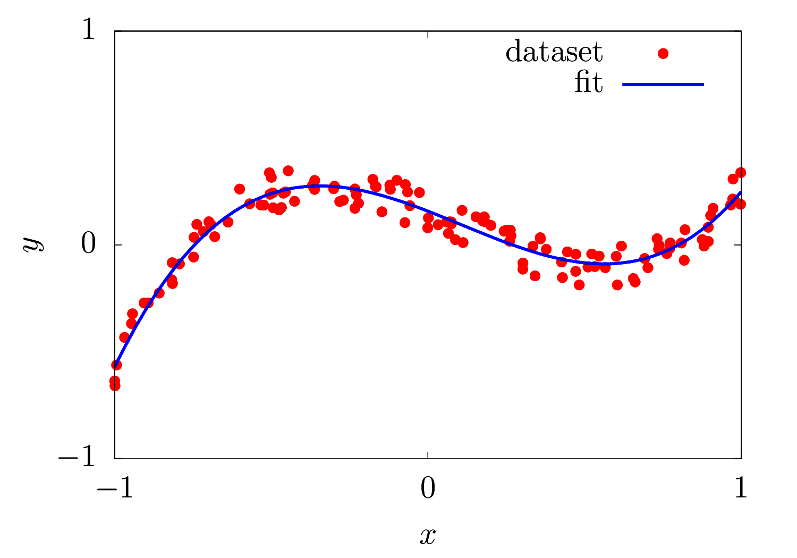

# Least squares

Fitting data points with a polynomial by minimizing the squared distance in Euclidean space.

## Reference

- Boyd and Vandenberghe, "Convex Optimization", 9.1.1, Cambridge University Press, 2004

