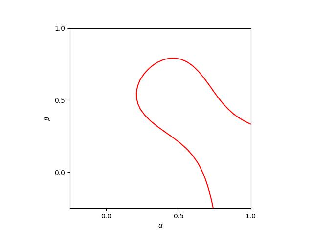

.. include:: ./reference.txt

###################
Third-order methods
###################

Third-order explicit Runge-Kutta methods are given by

.. math::

    & q^0 = p^n

    & q^1 = p^n + a_{1,0} f \left( q^0 \right) \Delta t

    & q^2 = p^n + a_{2,0} f \left( q^0 \right) \Delta t + a_{2,1} f \left( q^1 \right) \Delta t

    & q^3 = p^n + a_{3,0} f \left( q^0 \right) \Delta t + a_{3,1} f \left( q^2 \right) \Delta t + a_{3,2} f \left( q^3 \right) \Delta t

    & p^{n + 1} = q^3

The Butcher tableau is

.. math::

    \begin{array}{c|ccc}
    b_0 & a_{0,0} & a_{0,1} & a_{0,2} \\
    b_1 & a_{1,0} & a_{1,1} & a_{1,2} \\
    b_2 & a_{2,0} & a_{2,1} & a_{2,2} \\
    \hline
    & a_{3,0} & a_{3,1} & a_{3,2} \\
    \end{array}
    =
    \begin{array}{c|ccc}
    0 & 0 & 0 & 0 \\
    \alpha & \alpha & 0 & 0 \\
    \beta & \frac{\beta}{\alpha} \frac{3 \alpha^2 - 3 \alpha + \beta}{3 \alpha - 2} & - \frac{\beta}{\alpha} \frac{\beta - \alpha}{3 \alpha - 2} & 0 \\
    \hline
    & 1 - \frac{3 \alpha + 3 \beta - 2}{6 \alpha \beta} & \frac{3 \beta - 2}{6 \alpha \left( \beta - \alpha \right)} & \frac{- 3 \alpha + 2}{6 \beta \left( \beta - \alpha \right)} \\
    \end{array}

where the elements are constrained by two free parameters :math:`\left( \alpha, \beta \right)`.

The low-storage schemes can be derived in the same manner as the second-order schemes; namely by substituting :math:`q^0` with the previous-step value:

.. math::

    & q^0 = p^n

    & r^0 = f \left( q^0 \right)

    & q^1 = q^0 + a_{1,0} r^0 \Delta t

    & r^1 = \frac{a_{2,0} - a_{1,0}}{a_{2,1}} f \left( q^0 \right) + f \left( q^1 \right)

    & q^2 = q^1 + a_{2,1} r^1 \Delta t

    & r^2 = \frac{a_{3,1} - a_{2,1}}{a_{3,2}} \left\{ \frac{a_{3,0} - a_{2,0}}{a_{3,1} - a_{2,1}} f \left( q^0 \right) + f \left( q^1 \right) \right\} + f \left( q^2 \right),

    & q^3 = q^2 + a_{3,2} r^2 \Delta t

    & p^{n + 1} = q^3

The coefficients :math:`\beta^k, \gamma^k` are computed from the values in the Butcher tableau:

.. math::

    \begin{array}{c|ccc}
    k & 0 & 1 & 2 \\
    \hline
    \beta^k & 0 & \frac{a_{2,0} - a_{1,0}}{a_{2,1}} & \frac{a_{3,1} - a_{2,1}}{a_{3,2}} \\
    \gamma^k & a_{1,0} & a_{2,1} & a_{3,2} \\
    \end{array}

To be a low-storage scheme, the coefficients need to satisfy

.. math::

    \frac{a_{2,0} - a_{1,0}}{a_{2,1}}
    =
    \frac{a_{3,0} - a_{2,0}}{a_{3,1} - a_{2,1}},

so that :math:`r^2` can be directly computed using :math:`r^1`.

Assigning the Butcher tableau to this relation yields

.. math::

    6 \alpha^2 \beta
    -
    6 \alpha \beta^2
    +
    3 \alpha \beta
    -
    3 \alpha
    +
    6 \beta^2
    -
    6 \beta
    +
    2
    =
    0.

.. literalinclude:: ./derive_third_order_methods.py
    :language: python
    :pyobject: find_constraint

The following method is popular among others (|WILLIAMSON1980|).

.. math::

    \left( \alpha, \beta \right)
    =
    \left( \frac{1}{3}, \frac{3}{4} \right)

.. math::

    \begin{array}{c|ccc}
    0 & 0 & 0 & 0 \\
    \frac{1}{3} & \frac{1}{3} & 0 & 0 \\
    \frac{3}{4} & \frac{-3}{16} & \frac{15}{16} & 0 \\
    \hline
    & \frac{1}{6} & \frac{3}{10} & \frac{8}{15} \\
    \end{array}

.. math::

    \begin{array}{c|ccc}
    k & 0 & 1 & 2 \\
    \hline
    \beta^k & 0 & \frac{-5}{9} & \frac{-153}{128} \\
    \gamma^k & \frac{1}{3} & \frac{15}{16} & \frac{8}{15} \\
    \end{array}

